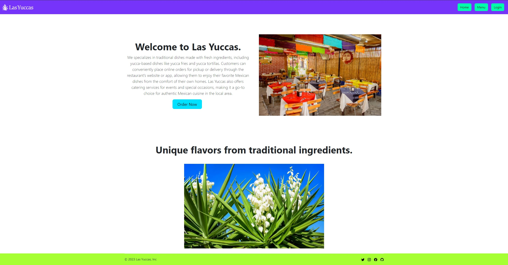

# Las Yukkas

## Table of Contents

- [Description](#description)
- [Technologies](#technologies)
- [Deployed Application](#deplyed-application)
- [Future Improvements](#future-improvements)
- [Installation](#installation)
- [Usage](#usage)
- [Credits](#credits)
- [License](#license)

## Description
The purpose of this project is to create base skeletal structure for any restruants to use to build their specific website with ease.
It allows the restruant to set up a website that allows users to create a login to browse and order food from a menu designed by the resturant. 

## Technologies
Node.js
Axios
MongoDB & Mongoose
React
Heroku deployment

## Deployed Application
This app is deployed to Heroku: [https://las-yuccas.herokuapp.com/]

and housed on Github: [https://github.com/chazillaa/las-yuccas]

## Future Improvements
- Add payment option
- add the ability to change and remove specific ingredients
- organize items by section
- reserve table online
- save favorite carts

## Installation
clone github repo
cd server/
npm install
npm start
open new terminal
cd client/
npm install
npm run build
npm start
Go to http://localhost:3001
OR follow the above heroku deployed application link

## Usage
How to use: This app is best for restruants looking to build a website for users to order online.

Screenshots:
Below are screenshots of the restruant Las Yukkas:

Main Page: 
Menu Page... 
Cart Page... 

## Credits
Collaborators:
Jacob Nollen (Github: jnollen23), Issac Cha (Github: Chazillaa), Victor Yang (Github: vyang9887)

## License
No licenses.

